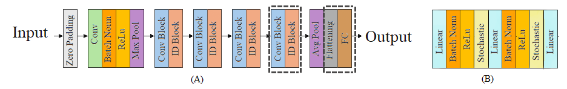

# Optimizied_TumorClassifierResNetSD
A Novel Optimized ResNet-SD Model for Brain Tumor Classification Using Stochastic Depth and Metaheuristic Optimization


<p align="justify">
This is the official <strong>Optimizied_TumorClassifierResNetSD</strong> implementation repository with PyTorch.<br/><br/>

</p>
<p align="center">
<br><br><br><br>

<br>
<b>Optimizied TumorClassifierResNetSD Architecture</b>
<br><br><br><br>
</p>

## Setup

Clone the repository.

```
git clone https://https://github.com/nafiuny/Optimized_TumorClassifierResNetSD.git
cd Optimized_TumorClassifierResNetSD
```


